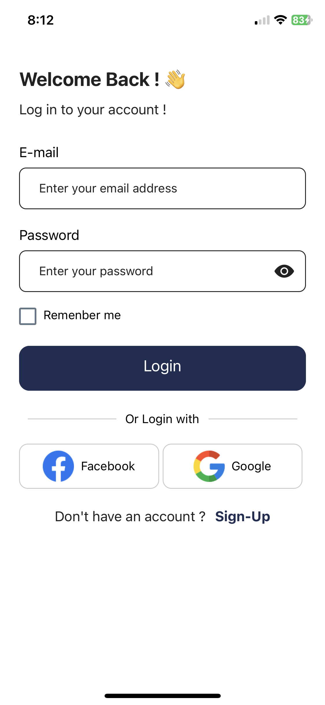

# React Native UI Project

Welcome to the React Native UI Project! This project is a UI-only application built using React Native and Expo. Below, you'll find information about the project's features, technologies used, and instructions on how to get started.

## Screenshots




## Features

- Beautiful and responsive user interface
- Built with React Native and Expo
- Easy to customize and extend

## Technologies Used

- **React Native**: A framework for building native apps using React.
- **Expo**: A platform for making universal React applications.

## Getting Started

### Prerequisites

Before you begin, ensure you have met the following requirements:

- Node.js installed on your machine
- npm or yarn package manager
- Expo CLI installed globally (`npm install -g expo-cli`)

### Installation

1. Clone the repository:

    ```bash
    git clone https://github.com/itshakim213/login-register-ui.git
    cd login-register-ui
    ```

2. Install the dependencies:

    ```bash
    npm install
    # or
    yarn install
    ```

3. Start the Expo development server:

    ```bash
    expo start
    ```

4. Use the Expo Go app on your mobile device to scan the QR code generated in the terminal, or use an emulator to run the project.

## Usage

Once the application is running, you can:

- Explore the UI components
- Customize styles and components to fit your needs


## Contact

If you have any questions or suggestions, feel free to open an issue in the repository or contact me directly at sidali.ikh@outlook.com .

---

Thank you for checking out the React Native UI Project!
